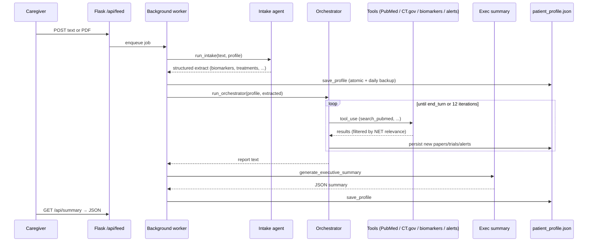

# NET/Care Research Agent

A multi-agent AI system that continuously monitors clinical developments for a Grade 2
metastatic neuroendocrine tumor (NET) patient. Operated by the patient's caregiver.

The agent ingests clinical documents, extracts structured medical data, searches
PubMed and ClinicalTrials.gov, synthesises findings into actionable summaries, and
learns from every consultation with the treating oncologist.

> ⚠️ **Decision-support tool only.** Output must be reviewed by a qualified clinician
> before any medical action. Not a medical device.

## Architecture

| Layer       | Implementation                                              |
|-------------|-------------------------------------------------------------|
| LLM         | Anthropic Claude (Sonnet 4.6) with tool use                 |
| Backend     | Flask + gunicorn                                            |
| Storage     | JSON file on Azure Files mount (`/home/data`)               |
| Frontend    | Single-page vanilla JS UI (`static/index.html` + `app.js` + `styles.css`) |
| Hosting     | Azure App Service (Linux, swedencentral) behind Easy Auth (Microsoft account) |
| Secrets     | Azure Key Vault + system-assigned managed identity on the webapp |
| External    | PubMed E-utilities, ClinicalTrials.gov API v2               |

## Local development

Requires Python 3.11.

```powershell
# 1. Create venv and install
python -m venv .venv
.venv\Scripts\Activate.ps1
pip install -e ".[dev]"

# 2. Configure secrets
Copy-Item .env.example .env
# edit .env and set ANTHROPIC_API_KEY

# 3. Run
.\Scripts\run_local.ps1
# or:  python app.py --port 8000
```

Open http://localhost:8000.

## Tests

```powershell
pytest
```

Tests use recorded HTTP fixtures for PubMed and ClinicalTrials.gov, a fake Anthropic
client, and a temporary data directory — no network calls, no API key required.

## Lint & format

```powershell
ruff check agent tests          # CI runs this on every push
ruff format agent tests         # auto-format
pre-commit install              # one-time: install git hooks
```

`ruff` is also wired into `.pre-commit-config.yaml` along with whitespace,
EOL, YAML, TOML, large-file, and private-key checks. Dependabot watches both
pip and GitHub Actions deps weekly.

## Deployment

Azure App Service (Linux). See `startup.sh` for the gunicorn launch command.

Environment variables to set as Application Settings:

- `ANTHROPIC_API_KEY` (required) — **in production this is a Key Vault reference**
  (`@Microsoft.KeyVault(SecretUri=https://<keyvault-name>.vault.azure.net/secrets/ANTHROPIC-API-KEY/)`),
  resolved via the webapp's system-assigned managed identity. See
  [`AGENTS.md` → Secrets](AGENTS.md#secrets) for the rotation runbook.
- `DATA_DIR` defaults to `/home/data` on Azure (Azure Files mount)
- `ANTHROPIC_MODEL` defaults to `claude-sonnet-4-6`; per-role overrides
  (`ANTHROPIC_MODEL_INTAKE`, `ANTHROPIC_MODEL_ORCHESTRATOR`, …) — see
  `.env.example`

## Profile schema

All patient state lives in a single JSON file at `${DATA_DIR}/patient_profile.json`:

```
{
  "patient": { ... },
  "biomarkers":  [ {date, marker, value, unit, ref_low, ref_high}, ... ],
  "imaging":     [ {date, modality, findings, impression}, ... ],
  "treatments":  [ {name, status, start_date, end_date, ...}, ... ],
  "documents":   [ {date, type, summary, key_findings}, ... ],
  "trials":      [ {nct_id, title, status, ...}, ... ],
  "papers":      [ {pmid, title, journal, date}, ... ],
  "alerts":      [ {priority, action, created, resolved}, ... ],
  "judgments":   [ {category, text, date, source}, ... ],
  "questions":   [ {id, text, category, priority, asked}, ... ],
  "exec_summary": { ... }
}
```

A daily backup is written to `${DATA_DIR}/backups/profile_YYYYMMDD.json`
(retention: 30 days).

## Safety notes

- All Claude calls that produce structured output run at `temperature=0`.
- Clinical judgments from the oncologist override AI recommendations as hard constraints.
- Trial and paper relevance is filtered before being persisted.
- Treatment names are fuzzy-matched against synonyms (Somatuline = lanreotide etc.).
- The patient profile is the only source of truth; no conversation state persists.

## Repository layout

```
.
├── README.md             # This file
├── HANDOFF.md            # Single-page primer for new AI assistants — start here
├── CHANGELOG.md          # User-visible changes per version
├── AGENTS.md             # Onboarding + doc-update policy for AI assistants
├── app.py                # Flask app: HTTP endpoints + background jobs + /api/health
├── net_agent.py          # Back-compat shim — re-exports the agent.* package
├── agent/                # Modular agent core
│   ├── config.py         # paths + per-agent ANTHROPIC_MODEL_* env overrides
│   ├── llm.py            # Anthropic client + JSON-fence stripper
│   ├── profile.py        # load/save (atomic) + DEFAULT_PROFILE + summary
│   ├── io.py             # atomic_write_text helper
│   ├── backups.py        # daily snapshot + 30-day retention
│   ├── logging_config.py # text/JSON log formatter
│   ├── judgments.py      # clinical-judgment context formatter
│   ├── intake.py         # extract structured medical data from text
│   ├── orchestrator.py   # agentic loop driving the tools
│   ├── classify.py       # treatment dedup + active/planned/completed
│   ├── exec_summary.py   # JSON executive summary generator
│   ├── questions.py      # Appointment questions (language via patient.language)
│   ├── chat.py           # /api/chat handler (pure function)
│   ├── cli.py            # `python net_agent.py {feed|digest|status|update-profile}`
│   └── tools/            # PubMed, ClinicalTrials.gov, biomarker trends + dispatcher
├── static/                 # Single-page UI (Phase 4 split)
│   ├── index.html          # Markup + header (Feed popover, status pill, actions)
│   ├── app.js              # All client logic (feed, jobs, summary, chat, timeline)
│   └── styles.css          # Styles (incl. feed popover + unified main scroll)
├── startup.sh            # gunicorn launcher (Azure App Service)
├── pyproject.toml        # Python deps + tooling config
├── .env.example          # Template for local secrets
├── tests/                # pytest suite (45 tests, no network, no API key needed)
└── docs/                 # Architecture & schema docs
    ├── architecture.md
    ├── operating_manual.md
    └── profile_schema.md
```

## How it works (sequence)



The orchestrator's behaviour is shaped by **clinical_judgments** captured from
oncologist consultations. These act as hard constraints: anything the oncologist
has already addressed is excluded from the recommended actions.

## Operating manual

Day-to-day caregiver workflow lives in [`docs/operating_manual.md`](docs/operating_manual.md).
The most common loops:

| Action | Where | What happens |
|---|---|---|
| Add a clinical document | Header → **📄 Feed** button → popover (paste text or upload file) | Intake → orchestrator → exec summary refreshed |
| Run a research-only sweep | Header → **↻ Run digest** | Orchestrator runs without new input; new trials/papers added |
| Record an oncologist's judgment | UI → "Judgments" tab → Add | Becomes a hard constraint for future runs |
| Resolve / dismiss an alert | UI → Alert card → Resolve | Marked resolved, persisted in profile |
| Generate appointment questions | UI → "Questions" tab → Generate | Question list (language via `patient.language`) tailored to current profile |
| Chat with the record | Header → **✦ Ask Claude** | `/api/chat` grounds Claude in the full profile |
| Open a trial | Exec summary → "Best matched trial" chip | Opens `clinicaltrials.gov/study/<NCT_ID>` in a new tab |

## Keeping docs current

Whenever the UI flow, repo layout, or HTTP/CLI surface changes, update:

- `README.md` — architecture table, repo layout tree, operating-loops table
- `docs/operating_manual.md` — caregiver workflows
- `docs/architecture.md` — component or topology diagrams if endpoints/agents change
- `CHANGELOG.md` — every user-visible change goes under `[Unreleased]`

The full doc-update policy (which doc to touch for which kind of change),
commit conventions, deploy mechanism, and common pitfalls are in
[`AGENTS.md`](AGENTS.md). AI assistants working in this repo should read it
first.


